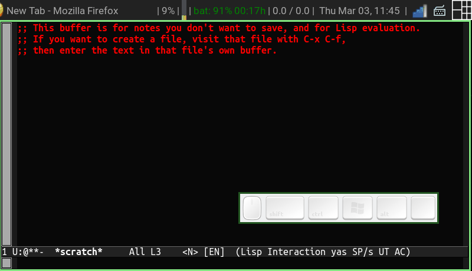
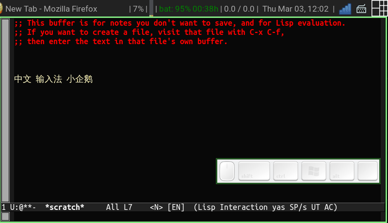

# evil-fcitx.el
**fcitx toggling helper for evil-mode**

## 安装

需要: 1.[evil-mode](https://www.emacswiki.org/emacs/Evil), 2.Fcitx __fcitx-remote__ 命令行工具(一般在fcitx包里带了)

首先确认 fcitx-remote 可用，测试方法

~~~bash
$ fcitx-remote -o ## 会启动输入法
$ fcitx-remote -c ## 会关闭输入法
~~~

如果以上的测试没有问题，那么就可以在 <code>.emacs</code> 或 <code>init.el</code> 里加入

~~~lisp
(add-to-list 'load-path "path/to/evil-fcitx")
(require 'evil-fcitx)
~~~

## 使用

正常的打字就可以了。(以下GIF中的IME切换键为<s-SPC>)

* 在 <code>insert-mode</code> 时，可以通过 fcitx 预设的输入法切换按键(如<code>CTRL+SPC</code>)换输入法，若在中文状态下按 <ESC> ，__evil-fcitx__ 会将输入法切回英文并记录此时处于英文状态 (在 [mode-line](https://www.emacswiki.org/emacs/ModeLine) 里会有一个 __[ZH]__ 的标志)，下次进入 <code>insert-mode</code> 时 __evil-fcitx__ 会再切回中文输入法。

* 在 <code>normal-mode</code> 时，可以按 <code>C-c C-q</code> 清除 __[ZH]__ 状态，这样下次进入 <code>insert-mode</code> 里就不会切回中文了。

* 在 <code>normal-mode</code> 时，使用 __f/F__ __t/T__ __r__ __/ ?__ 也可以输入中文。例如按下 <code>f</code> 后可以切换成中文，输入一个字后输入法会回到中文。

~~~
f <Toggle IME>中
t <Toggle IME>文
/ <Toggle IME>にほんご<RET>
~~~

有几个可选的选项, 在 evil-fcitx.el 的前几行

~~~lisp
;;;;;;;;;; User configs

(defvar force-back-to-default-state-key "C-c C-q")

; Indicator to be displayed in mode-line, like <N>/<I> for Evil-mode
(defvar user-IME-state-indicator "[ZH]")
(defvar default-IME-state-indicator "[EN]")
~~~

正统的vim粉还可以看看 [fcitx.vim](http://www.vim.org/scripts/script.php?script_id=3764)

## Installation

Requirement: Emacs Evil-mode, Fcitx with __fcitx-remote__ cli tool

~~~lisp
(add-to-list 'load-path "path/to/evil-fcitx")
(require 'evil-fcitx)
~~~

## Usage

### Basic:

Just type around, evil-fcitx would be invoked as you enable IME in __insert-state__.

P.S.Type __C-q__(or else in variable __back-to-default-state-key__) when you quit insert state with IME on, and don't want to type English next time you enter insert state.

### In Normal State/Mode

Sometime there is a need to use __f/F__ __t/T__ __r__ __/ ?__ with a non-ascii char/word as argument. You can type:

~~~
f <Toggle IME>中
t <Toggle IME>文
/ <Toggle IME>にほんご<RET>
~~~

### Mode-line tag:

There is an automatically added mode-line-tag, right next to evil-mode-line-tag(the <N> <I> stuff), by default are \[EN\] \[ZH\].
Emacs can not get IME info in real time, so the mode line tag will just be like this: \[--\].

Fcitx would automatically back to English mode.

## Brief

Vim-like modeling editing is awesome, it uses __mode__ to provide a large enough keystroke space(and save your pinky at the same time). However, the aproch is really unfriendly to non-English users who uses an IME, they have to toggle IME again and again when jumping from mode to mode.

Using fcitx-remote to automatically toggle IME, evil-fcitx could be one more reason for non-English emacs users who uses fcitx IME to taste the power of modeling editing.

Inspired by fcitx.vim, but IME-state is global for now, which means you better back to evil-normal-state before jump to another buffer. To be improved later.

See also [fcitx.vim](http://www.vim.org/scripts/script.php?script_id=3764)

BTW, Evil Mode does implement something like evil-fcitx (read from evil-core.el :func evil-(de)active-input-method). However, it just work for IMEs which are embedded in Emacs, those IME are not widely accept by Emacs users as far as I know.

## TODOs

The script would grow as using it. I wish it could be a Emacs front-end of Fcitx someday.

* __DONE__ Adding a mode-line tag automatically
* Fully support search non-ASCII char/string in normal state.
..* Support more than two languages other than English.
* State record for every single buffer
